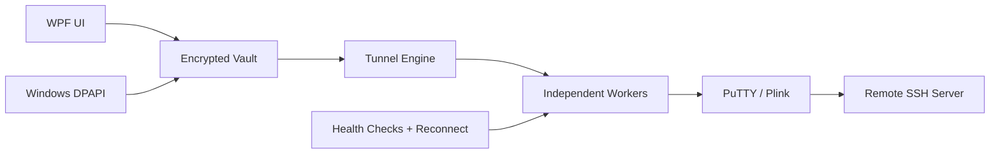
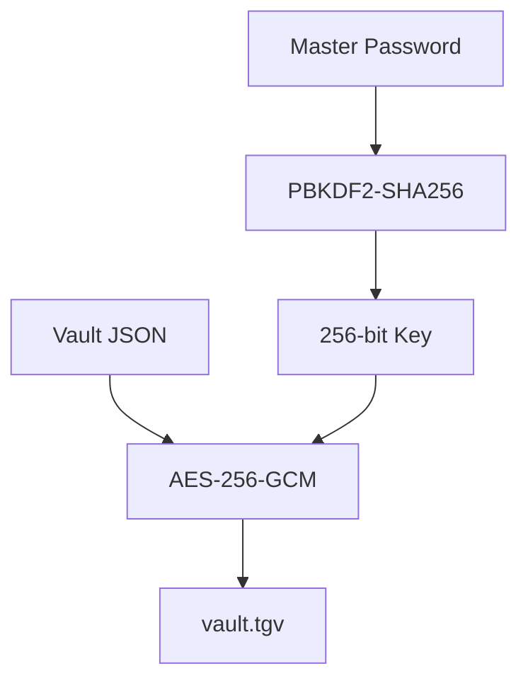

# TunnelGate

<p align="center"></p>

<h3 align="center">Native Windows SSH Tunnel Manager</h3>

<p align="center">Secure reverse SSH tunnels and local SOCKS proxies with encrypted local storage, independent workers, health checks, reconnect logic and a self-contained installer.</p>

<p align="center">  </p>

## Supported platforms
| Platform | Support | Notes |
|---|---:|---|
| Windows 10/11 x64 | ✅ | Full WPF application and installer |
| Linux | ❌ | Current UI/runtime integration is Windows-specific |
| macOS | ❌ | Current UI/runtime integration is Windows-specific |

## Architecture


## Highlights
- reverse SSH forwarding (`plink -R`)
- local SOCKS proxying (`plink -D`)
- categories and multiple profiles
- per-tunnel workers, reconnect and scheduled restart
- SSH keepalive, compression and optional host-key pinning
- password or private-key authentication
- AES-256-GCM encrypted local vault
- PBKDF2-SHA256 key derivation
- Windows DPAPI session restoration
- encrypted backup/import
- DNS/network adapter tools
- Windows startup integration
- self-contained application and installer

## Security model

Runtime data is stored under `%LOCALAPPDATA%\TunnelGate`. Do not commit vault files, backups, SSH keys, passwords, logs or `.env` files.

## Plink integration
If `tools/plink.exe` exists at build time it can be embedded. If it is absent, TunnelGate remains buildable and can download the official PuTTY Plink executable on first use.

## Build requirements
- Windows 10/11 x64
- .NET 8 SDK
- PowerShell 5.1+ or PowerShell 7+

## Build
```powershell
./build-native.ps1
```
Application + installer:
```powershell
./build-installer.ps1
```
Expected outputs:
```text
output/TunnelGate.exe
installer-output/TunnelGate-Setup.exe
```

## Repository layout
```text
TunnelGate/
├─ Assets/
├─ Core/
├─ Installer/
├─ Models/
├─ UI/
├─ tools/
├─ App.xaml
├─ TunnelGate.Native.csproj
├─ build-native.ps1
├─ build-installer.ps1
└─ migrate_legacy.py
```

## Reverse bind note
A non-loopback remote bind can require a suitable `GatewayPorts` setting on the SSH server. Final bind policy is controlled by the remote SSH daemon.

## Threat model
TunnelGate protects local configuration against casual disclosure/offline vault inspection. It does not protect against a fully compromised Windows account, malware with equivalent privileges, a hostile unlocked session, or a malicious SSH server.

## Third-party software
TunnelGate can use Plink from the PuTTY project. PuTTY/Plink is a separate open-source project.

## Author
**Danial Zolfaghari** — [@Danial-Zolfaghari](https://github.com/Danial-Zolfaghari)
