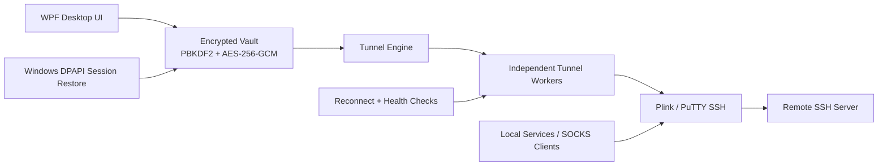
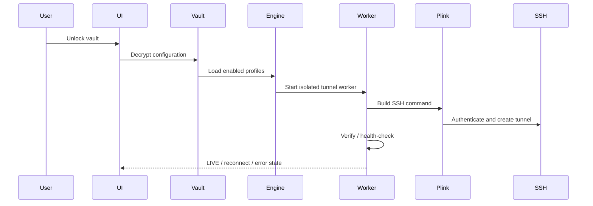
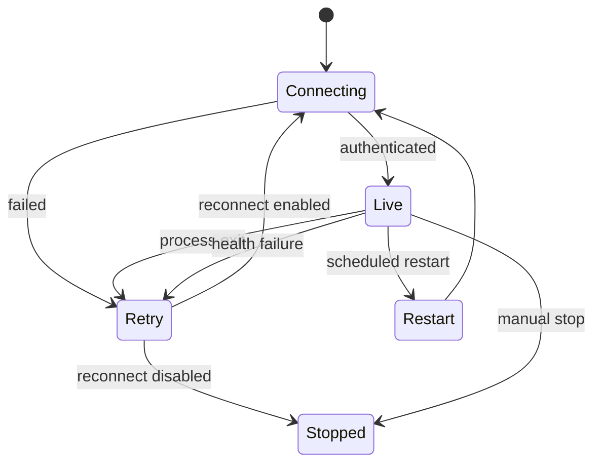
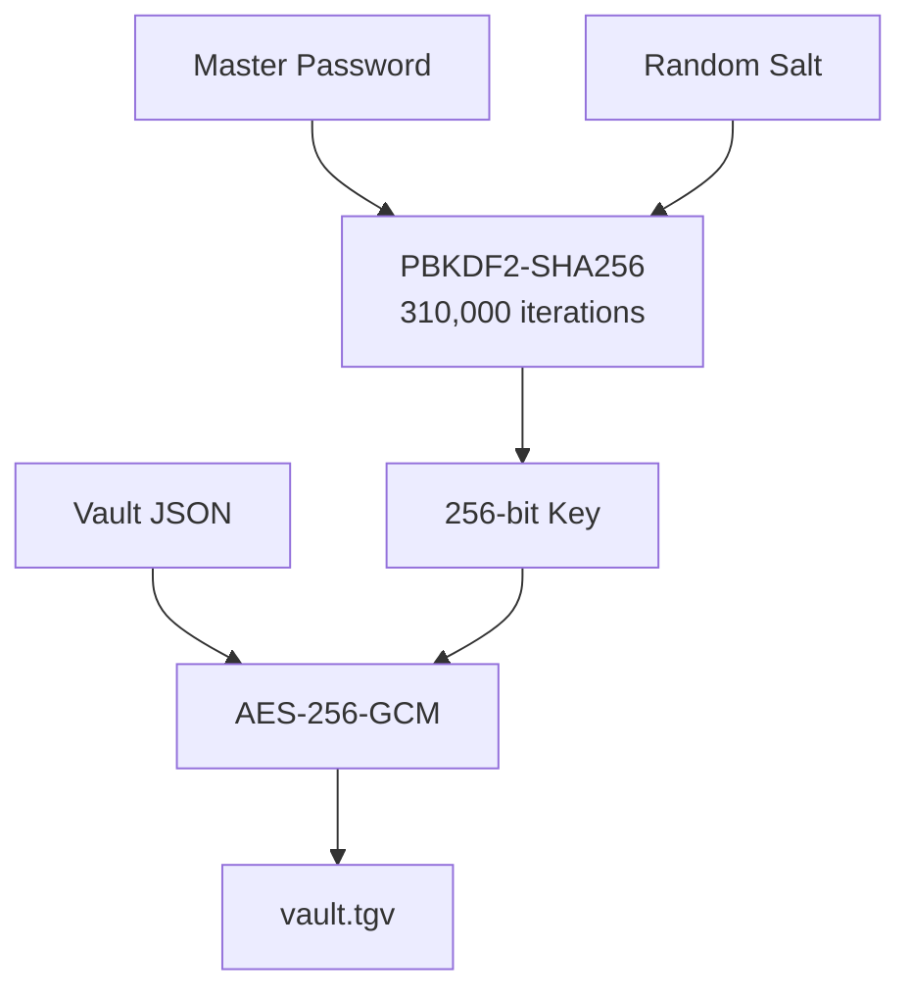

# TunnelGate

<p align="center">
  
</p>

<h3 align="center">Native Windows SSH Tunnel Manager</h3>

<p align="center">
  A secure desktop manager for reverse SSH tunnels and local SOCKS proxies — built with .NET 8, WPF, encrypted local storage, automatic reconnect, health checks, and a self-contained installer.
</p>

<p align="center">
  
  
  
  
  <a href="https://github.com/Danial-Zolfaghari/TunnelGate/actions/workflows/build.yml">
    
  </a>
</p>

---

## Supported platforms

| Platform | Support | Notes |
|---|---:|---|
| Windows 10/11 x64 | ✅ | Native WPF application; primary and supported target |
| Linux | ❌ | Current UI/runtime depends on Windows WPF, DPAPI and registry integration |
| macOS | ❌ | Current UI/runtime is Windows-specific |

## Overview

TunnelGate turns repetitive SSH tunneling workflows into a persistent Windows desktop experience.

Instead of keeping multiple terminal sessions open or manually rebuilding Plink commands after a disconnect, TunnelGate manages profiles, tunnel definitions, encrypted credentials, connection workers, retries, startup behavior, health verification, and packaging from one interface.

It supports two primary tunnel modes:

- **Reverse forwarding** using `plink -R`
- **Local SOCKS proxying** using `plink -D`

The application is designed around a local encrypted vault and independent tunnel workers, so one failing tunnel does not have to bring down every other active route.

---

## Architecture



### Runtime flow



---

## Feature Set

### Tunnel management

| Capability | Status |
|---|---|
| Reverse SSH tunnels | ✅ |
| Local SOCKS proxies | ✅ |
| Multiple profiles | ✅ |
| Categories | ✅ |
| Per-tunnel enable/disable | ✅ |
| Independent workers | ✅ |
| Automatic reconnect | ✅ |
| Exponential reconnect backoff | ✅ |
| Scheduled tunnel restart | ✅ |
| SSH compression | ✅ |
| SSH keepalive | ✅ |
| Host-key fingerprint pinning | ✅ |
| Password authentication | ✅ |
| Private-key authentication | ✅ |

### Security and local storage

| Component | Implementation |
|---|---|
| Vault encryption | AES-256-GCM |
| Password KDF | PBKDF2-SHA256 |
| KDF iterations | 310,000 |
| Session restore | Windows DPAPI |
| Backup encryption | AES-256-GCM |
| Backup KDF | PBKDF2-SHA256 |
| Password masking in runtime logs | Yes |
| Local-only configuration storage | Yes |

### Windows integration

- Windows startup integration
- Per-user installation
- Self-contained single-file application
- Self-contained installer
- Start Menu shortcut
- Desktop shortcut
- Uninstaller registration
- Dark Windows title bar integration
- DNS management tools
- Network adapter inspection

---

## Tunnel Modes

### Reverse tunnel

A reverse tunnel exposes a service reachable from the TunnelGate machine through the remote SSH server.

```text
Remote client
     │
     ▼
SSH server : RemotePort
     │
     │  reverse SSH forwarding
     ▼
TunnelGate machine : LocalHost:LocalPort
```

Conceptually:

```text
plink -R <remote-bind>:<remote-port>:<local-host>:<local-port>
```

### SOCKS proxy

A SOCKS configuration exposes a local dynamic proxy through the SSH connection.

```text
Application
    │
    ▼
127.0.0.1 : SOCKS_PORT
    │
    ▼
TunnelGate / Plink
    │
    ▼
SSH server
    │
    ▼
Destination network
```

Conceptually:

```text
plink -D <bind-address>:<local-port>
```

---

## Reliability Model

TunnelGate does not treat all tunnel definitions as one monolithic process.

Each enabled tunnel runs through an independent worker with its own:

- lifecycle
- process state
- health state
- retry logic
- reconnect timing
- scheduled restart handling

This means one invalid or temporarily unreachable tunnel can fail without blocking every other valid tunnel in the profile.

### Reconnect behavior



---

## Plink / PuTTY Integration

TunnelGate uses **Plink**, the command-line SSH client from the PuTTY project.

The project supports two deployment modes:

1. **Bundled mode**  
   Place an official `plink.exe` at:

   ```text
   tools/plink.exe
   ```

   The binary is embedded into the published TunnelGate executable.

2. **Runtime download mode**  
   If no bundled binary exists, TunnelGate still builds successfully and downloads the official Plink binary from the PuTTY project's official host when first required.

This avoids committing an unverified third-party executable while keeping a clean source checkout buildable.

---

## Security Model

TunnelGate keeps its persistent configuration under the current Windows user's Local AppData directory.

```text
%LOCALAPPDATA%\TunnelGate
```

Typical runtime data includes:

```text
TunnelGate/
├─ vault.tgv
├─ lockout.json
├─ session.key
├─ TunnelGate.log
└─ tools/
   └─ plink.exe
```

### Vault flow



### Session restore

After a successful unlock, TunnelGate can protect the derived session key using Windows DPAPI for the current Windows user.

The interactive master-password gate remains separate from background tunnel startup behavior.

### Backup handling

Encrypted backup exports use their own salt, nonce, authentication tag, and KDF parameters.

Do **not** commit:

- vault files
- exported backups
- SSH private keys
- passwords
- runtime logs containing environment-specific infrastructure
- local `.env` files

---

## Build Requirements

- Windows 10 or Windows 11
- x64 environment
- .NET 8 SDK
- PowerShell 5.1+ or PowerShell 7+

Check your SDK:

```powershell
dotnet --version
```

---

## Build

### Build the application

```powershell
./build-native.ps1
```

Expected output:

```text
output/TunnelGate.exe
```

### Build application and installer

```powershell
./build-installer.ps1
```

Expected outputs:

```text
output/TunnelGate.exe
installer-output/TunnelGate-Setup.exe
```

You can also use:

```bat
build-all.bat
```

---

## Repository Layout

```text
TunnelGate/
├─ .github/
│  └─ workflows/
│     └─ build.yml
├─ Assets/
│  ├─ TunnelGate.ico
│  └─ TunnelGateIcon.png
├─ Core/
│  ├─ AppPaths.cs
│  ├─ AppRuntime.cs
│  ├─ NetworkTools.cs
│  ├─ PlinkManager.cs
│  ├─ PortManager.cs
│  ├─ SecureVault.cs
│  ├─ StartupManager.cs
│  ├─ ThemeHelper.cs
│  ├─ TunnelEngine.cs
│  ├─ TunnelValidation.cs
│  └─ TunnelWorker.cs
├─ Installer/
├─ Models/
├─ UI/
├─ tools/
│  └─ README.md
├─ App.xaml
├─ App.xaml.cs
├─ TunnelGate.Native.csproj
├─ build-native.ps1
├─ build-installer.ps1
├─ SECURITY.md
└─ README.md
```

---

## CI

Every push and pull request targeting `main` is built on a clean Windows GitHub Actions runner.

The workflow validates the repository and then builds both artifacts:

```text
TunnelGate.exe
TunnelGate-Setup.exe
```

Build artifacts are uploaded to the workflow run for inspection.

---

## Reverse Bind Notes

If a reverse tunnel must listen beyond loopback on the SSH server, the SSH server configuration may need an appropriate `GatewayPorts` setting.

TunnelGate can request the forwarding configuration, but the final bind behavior is controlled by the remote SSH daemon.

---

## Threat Model

TunnelGate is designed to protect locally stored configuration against casual credential disclosure and offline inspection of the vault file.

It does **not** attempt to protect credentials from:

- a fully compromised Windows account
- malware running with equivalent or higher privileges
- an attacker controlling the unlocked interactive user session
- a malicious SSH server

Use host-key verification and trusted SSH infrastructure for production environments.

---

## Third-Party Components

TunnelGate can use **Plink** from the PuTTY project.

PuTTY / Plink is a separate open-source project and is not authored or maintained by TunnelGate.

---

## Author

**Danial Zolfaghari**

GitHub: [@Danial-Zolfaghari](https://github.com/Danial-Zolfaghari)

---

<p align="center">
  <strong>TunnelGate</strong><br/>
  Secure tunnels. Persistent workflows. Native Windows control.
</p>
